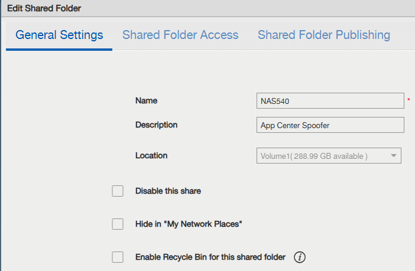
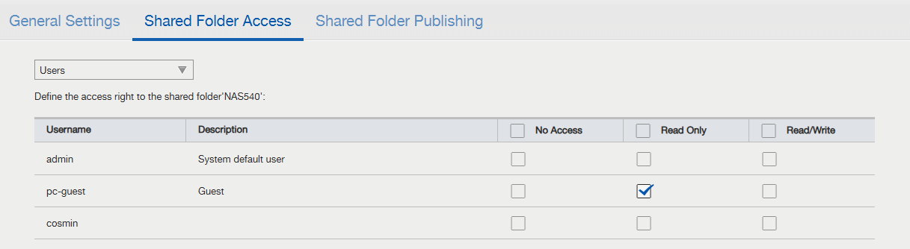
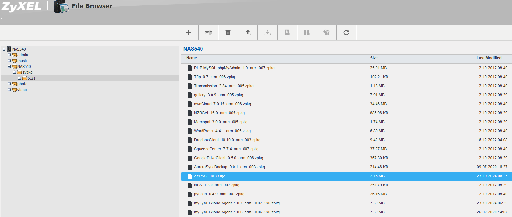
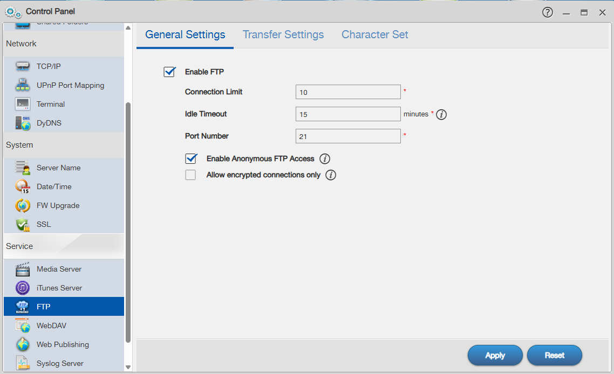
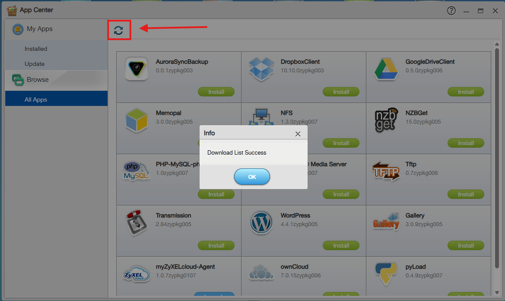

# ZYXEL - Home NAS Series (NAS326,NAS540,NAS542) App Center - Self Hosted

# Table of Contents

- [Prerequisites](#prerequisites)
- [App Center Self Hosted](#app-center-self-hosted)
  - [Explanation](#explanation)
  - [Placeholders](#placeholders)
  - [Process](#process)
- [Firmware Update](#firmware-update)
- [NSF tips](#nsf-tips)
- [References](#references)

# Prerequisites

1. Update firmware to latest version
 - offical firmware download site: https://www.zyxel.com/global/en/support/end-of-life
 - Internet archive (firmware and App Center Apps): TODO

 
2. App Center Apps
 - offical App Center Apps: https://community.zyxel.com/en/discussion/29667/important-announcement-end-of-ftp-service-support-for-home-nas-series
 - Internet archive (firmware and App Center Apps): TODO

3. Atleast 1 volume needs to be created before the App Center can be used.

# App Center Self Hosted

## Explanation

To prolong the support the App Center ftp server is replicated to a self hosted service on that same NAS. A configuration file that makes NAS to use its own ftp server is created. A filestructure that mimics the App Center Apps is created and exposed via the ftp server. 

## Placeholders

`NAS_MODEL` is the model name of your NAS device.
 - enum values: NAS326, NAS540, NAS542

## Process

1. Make sure the NAS is updated to the latest firmware.

[Firmware Update](#firmware-update)

2. Create a configuration file that makes NAS to use its own ftp server.

create a file named `web_prefix` (no file extension) with the following content:
```plaintext
ftp://<your NAS IP address>
```
example:
```plaintext
ftp://192.168.1.100
```

This file should be placed using the NAS web file manager at path:
(path includes the file itself)
```plaintext
<NAS_MODEL>/admin/zy-pkgs/web_prefix
```
example:
```plaintext
NAS540/admin/zy-pkgs/web_prefix
```


3. Create Shared Folder to mimic the App Center file structure.

Create a shared folder named `NAS_MODEL`.

example:
```plaintext
NAS540
```



Make folder readable by guest users.



4. Upload App Center Apps to the Shared Folder.

The apps should be dowloaded folowing the [Prerequisites](#prerequisites) section.

Upload the apps to the folder using the naming structire 
```plaintext
<NAS_MODEL>/zypkg/5.21/<app files>
```
example:
```plaintext
NAS540/zypkg/5.21/<app files>
```

! Also include the `ZYPKG_INFO.tgz` file.



5. Enable FTP Server (with anonymous access) on NAS.



6. Test the App Center.



# Firmware Update

TODO Create a guide on how to update the firmware of the NAS.

Official guide: https://support.zyxel.eu/hc/en-us/articles/16881179424786-Zyxel-Personal-Cloud-Storage-NAS-How-to-update-upgrade-your-Zyxel-NAS#h_01HP1YNN34ZSKHGVAA0180SCH2

# NSF tips

NFS, witch is mutch fater then the integrated SMB can be used via App Center app.

But shares are not visible by default in SMB cleints or web file manager.

To make shares visible craete a Share named `nfs` after enabling NFS and creating a share inside de app. This will make the root NFS folder a share itself.

# References

 - [ZyXEL Firmware Download for end-of-life devices](https://www.zyxel.com/global/en/support/end-of-life) (Download firmware for end-of-life devices)
 - [ZyXEL Community](https://community.zyxel.com/en/discussion/29667/important-announcement-end-of-ftp-service-support-for-home-nas-series) (Detailed guide of how to prolong app center support by Zyxel employees)


